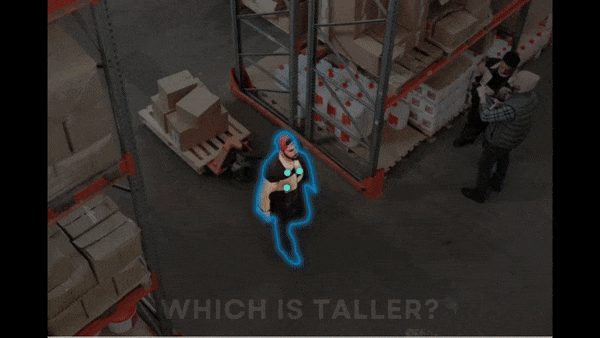

# VQASynth 🎹 
[](https://colab.research.google.com/drive/1sJUsJ5-UR-3Bydgg-thJ59KSNxRG8Q30?usp=sharing)

Try VQASynth on your image in the [HF Space](https://huggingface.co/spaces/remyxai/SpaceMantis)



**Spatial Reasoning** is fundamental to interacting within and navigating physical environments for embodied AI applications like robotics. However, data samples suitable for learning these capabilities are rare in AI pretraining datasets.
Don't be limited by what your model can do out-of-the-box, curate any image dataset from the Huggingface Hub for Spatial VQA with tools for scene understanding. 

VLMs trained using VQASynth 🎹 
* estimate 3D distances between objects in an image
* describe distances colloquially, convert between common units of measurement
* answer queries about the orientation and spatial relationships between objects
* base responses on consistent references like floors and surfaces

## Description

Fusing semantic and metric data into templated VQA chat, Vision Language Models can be instruction-tuned with low-rank adapters to enhance their baseline spatial reasoning capabilities. 
VQASynth 🎹 provides an open-source reproduction of [SpatialVLM](https://arxiv.org/abs/2401.12168), which describes a 3D scene reconstruction pipeline and prompt templates for enhancing the spatial reasoning abilities of VLMs including:

* Semantic filtering with [CLIP](https://github.com/openai/CLIP) to normalize the image distribution and attributes
* Metric Depth Estimation with [ZoeDepth](https://github.com/isl-org/ZoeDepth) to lift the 2D image to 3D point cloud
* Object-level captioning with [FlexCap](https://flex-cap.github.io/) for precise 2D region proposal
* Plane-fitting with RANSAC for consistent 3D reference coordinates

Initial VQASynth 🎹 pipelines prompted [LLaVA](https://github.com/haotian-liu/LLaVA) for JSON-formatted object-level detailed captions or tags using [RAM](https://github.com/xinyu1205/recognize-anything). Accordingly, we evaluated caption/tag based region proposal with publicly available models like [CLIPSeg](https://github.com/timojl/clipseg) and [groundingDINO](https://github.com/IDEA-Research/GroundingDINO).


## What's New 👀 in VQASynth 🎹

🪶 Faster & lighter using [Florence-2](https://arxiv.org/abs/2311.06242) for detailed image captions **and** region proposal grounded on text captions.

📐 Improves metric depth estimation speed & accuracy by replacing ZoeDepth with [DepthPro](https://github.com/apple/ml-depth-pro).

🎓 [SAM2](https://github.com/facebookresearch/sam2) replaces SAM in the localization refinement stage.


### Environment

Before running the demo scripts, ensure you have the following installed:
- Python 3.10 or later
- [Docker](https://docs.docker.com/engine/install/), [Docker Compose V2](https://docs.docker.com/compose/migrate/)
- [NVIDIA Container Toolkit](https://docs.nvidia.com/datacenter/cloud-native/container-toolkit/latest/install-guide.html)


## Run a Pipeline on Your Images

Use Docker Compose to transform Image datasets from Huggingface Hub into VQA datasets describing spatial relations between objects. 
You can process different datasets after updating the [config.yaml](config/config.yaml).

Then run the spatial VQA pipeline locally with Docker:

```bash
# Authenticate to push to hub
huggingface-cli login

# Run the pipeline
cd /path/to/VQASynth
bash run.sh
```
You can run the colab notebook using free-tier CPU or GPU acceleration or customize your own pipeline:
```python
from vqasynth.datasets import Dataloader
from vqasynth.embeddings import EmbeddingGenerator, TagFilter

dataloader = Dataloader(cache_dir)
dataset = dataloader.load_dataset(dataset_name)
embedding_generator = EmbeddingGenerator()
tag_filter = TagFilter()

include_tags = include_tags.strip().split(",")
exclude_tags = exclude_tags.strip().split(",")

# Extract embeddings
dataset = dataset.map(lambda example: embedding_generator.apply_transform(example, images))

# Extract tags
dataset = dataset.map(lambda example: tag_filter.apply_transform(example, include_tags + exclude_tags))

# Filter by tags
dataset_filtered = dataset.filter(
    lambda example: tag_filter.filter_by_tag(
        example['tag'], include_tags, exclude_tags
        )
    )
```

The resulting Huggingface dataset is in the cache directory and you can push to hub with:
```python
dataloader.push_to_hub(final_dataset, target_repo_name)
```

## Datasets from VQASynth 🎹

* [OpenSpaces](https://huggingface.co/datasets/remyxai/OpenSpaces)
* [vqasynth_spacellava](https://huggingface.co/datasets/remyxai/vqasynth_spacellava)
* [colmap_camera_specs](https://huggingface.co/datasets/salma-remyx/colmap_camera_specs)
  
Here are some examples:

|  |  |  |
|----------|-------------|--------|
| Does the red forklift in warehouse appear on the left side of the brown cardboard boxes stacked? | How close is the man in red hat walking from the wooden pallet with boxes? | Does the man in blue shirt working have a greater height compared to the wooden pallet with boxes on floor? |
| Incorrect, the red forklift in warehouse is not on the left side of the brown cardboard boxes stacked. | The man in red hat walking is 60.13 centimeters from the wooden pallet with boxes. | Indeed, the man in blue shirt working is taller compared to the wooden pallet with boxes on floor. |

  
## Models tuned on VQASynth 🎹

* [SpaceLLaVA - 13B](https://huggingface.co/remyxai/SpaceLLaVA)
* [SpaceMantis - 8B](https://huggingface.co/remyxai/SpaceMantis)
* [SpaceQwen2.5-VL-3B-Instruct - 3B](https://huggingface.co/remyxai/SpaceQwen2.5-VL-3B-Instruct)
* [SpaceFlorence-2 - <1B](https://huggingface.co/remyxai/SpaceFlorence-2)
* [SpaceVLMs Collection](https://huggingface.co/collections/remyxai/spacevlms-66a3dbb924756d98e7aec678)

Try SpaceLLaVA in [Discord](http://discord.gg/b2yGuCNpuC)


## Notebooks
We've hosted some notebooks visualizing and experimenting with the techniques included in this repo.

| Notebook | Description | Launch |
|----------|-------------|--------|
| Generate Spatial VQA Dataset | Augment an HF Image Dataset with Spatial VQA | [](https://colab.research.google.com/drive/1sJUsJ5-UR-3Bydgg-thJ59KSNxRG8Q30?usp=sharing) |
| Spatial Reasoning with Point Clouds | Visualize point clouds and evaluate spatial relationships | [](https://colab.research.google.com/drive/1f3rr-y233GvxWVzPE7_mK-DY52pG0fsm?usp=sharing) |

## References
This project was inspired by or utilizes concepts discussed in the following research paper(s):
```
@article{chen2024spatialvlm,
  title = {SpatialVLM: Endowing Vision-Language Models with Spatial Reasoning Capabilities},
  author = {Chen, Boyuan and Xu, Zhuo and Kirmani, Sean and Ichter, Brian and Driess, Danny and Florence, Pete and Sadigh, Dorsa and Guibas, Leonidas and Xia, Fei},
  journal = {arXiv preprint arXiv:2401.12168},
  year = {2024},
  url = {https://arxiv.org/abs/2401.12168},
}
```
