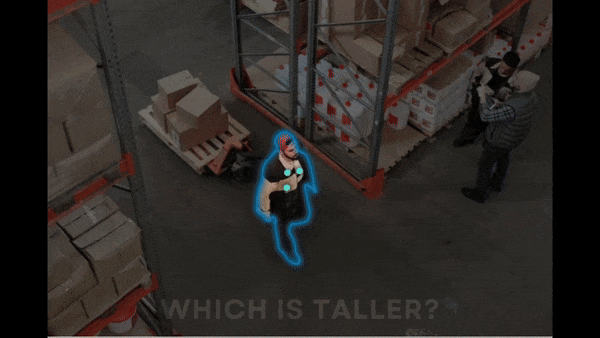
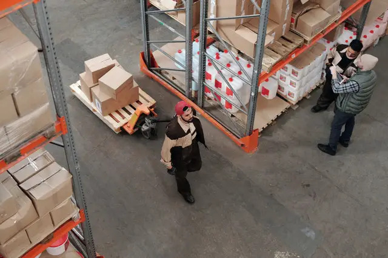
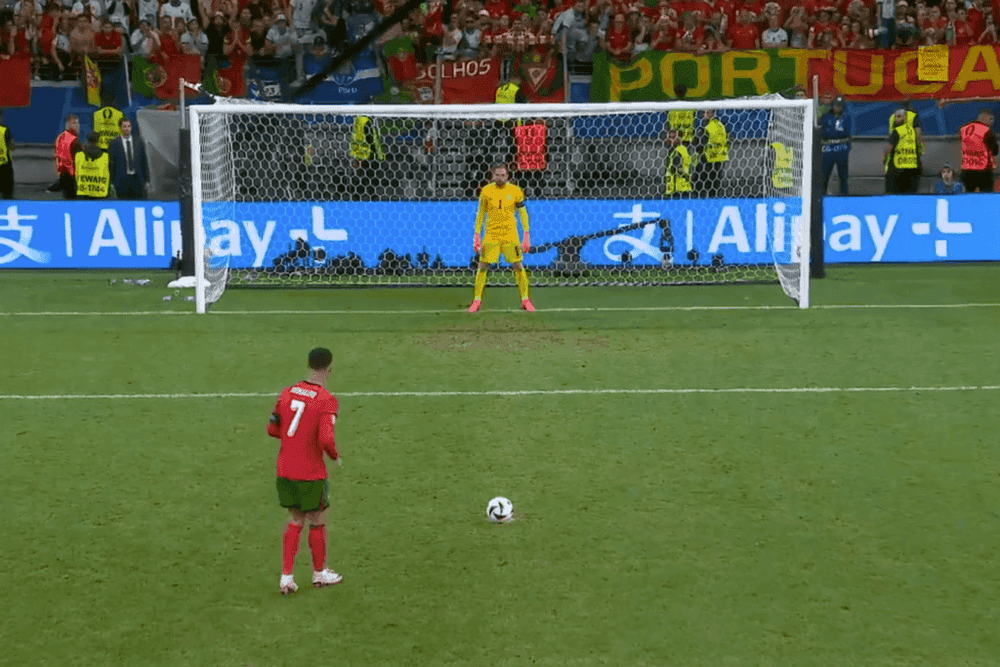
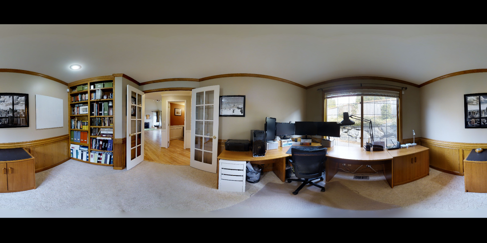

# VQASynth 🎹 



**Spatial Reasoning** is fundamental to interacting within and navigating physical environments for embodied AI applications like robotics. However, data samples suitable for learning these capabilities are rare in AI pretraining datasets.
Don't be limited by what your model can do out-of-the-box, curate any image dataset from the Huggingface Hub for Spatial VQA with tools for 3D scene understanding. 

VLMs trained using VQASynth 🎹 
* estimate 3D distances between objects in an image
* describe distances colloquially, convert between common units of measurement
* answer queries about the orientation and spatial relationships between objects
* base responses on consistent references like floors and surfaces
* apply CoT "thinking" for more robust reasoning and better estimates

## Run a Pipeline on Your Image Dataset

### Environment

Before running the demo scripts, ensure you have the following installed:
- Python 3.10 or later
- [Docker](https://docs.docker.com/engine/install/), [Docker Compose V2](https://docs.docker.com/compose/migrate/)
- [NVIDIA Container Toolkit](https://docs.nvidia.com/datacenter/cloud-native/container-toolkit/latest/install-guide.html)
- At least 24GB VRAM (A10 or larger) and 16GB RAM

Use Docker Compose to transform Image datasets from Huggingface Hub into VQA datasets describing spatial relations between objects.
You can process different datasets after updating the [config.yaml](config/config.yaml).

Then run the spatial VQA pipeline locally with Docker:

```bash
# Authenticate to push to hub
huggingface-cli login

# Run the pipeline
cd /path/to/VQASynth
bash run.sh
```

You can run the colab notebook (requires A100 runtime) or compose the pipeline modules in-process to turn one image into grounded spatial VQAs:

```python
from PIL import Image
from vqasynth.localize import Localizer
from vqasynth.scene_fusion import SpatialSceneConstructor
from vqasynth.prompts import PromptGenerator

image = Image.open("warehouse.jpg").convert("RGB")

# Detect + segment task-relevant objects
masks, _, captions = Localizer(captioner_type="florence").run(image)

# Lift to 3D — VGGT emits per-object point clouds, depth, and intrinsics in one pass
pcd_filepaths, canonicalized, _, _ = SpatialSceneConstructor().run(
    "warehouse_0", image, masks, output_dir="./scenes"
)

# Generate spatial VQAs from the reconstructed 3D scene
qa_pairs = PromptGenerator().run(captions, pcd_filepaths, canonicalized)

# Example output:
#   "How close is the man in red hat walking from the wooden pallet with boxes?"
#   → "Approximately 60.13 centimeters."
```

The resulting Huggingface dataset is in the cache directory and you can push to hub with:
```python
from vqasynth.datasets import Dataloader
Dataloader(cache_dir).push_to_hub(final_dataset, target_repo_name)
```

## Description

Fusing semantic and metric data into templated VQA chat, Vision Language Models can be instruction-tuned with low-rank adapters to enhance their baseline spatial reasoning capabilities. 
VQASynth 🎹 provides an open-source reproduction of [SpatialVLM](https://spatial-vlm.github.io/), which describes a 3D scene reconstruction pipeline and prompt templates for enhancing the spatial reasoning abilities of VLMs including:


🪄 Object-grounded captions by [point prompting with Molmo](https://github.com/remyxai/VQASynth/issues/27)

📐 Improves metric depth estimation speed & accuracy by replacing DepthPro with [VGGT](https://vgg-t.github.io/).

🪢 [SAM2](https://github.com/facebookresearch/sam2) replaces SAM in the localization refinement stage.

🧠 Multimodal "Thinking" by CoT Reasoning

## Datasets made using VQASynth 🎹

* [SpaceOm](https://huggingface.co/datasets/remyxai/SpaceOm)
* [SpaceThinker](https://huggingface.co/datasets/remyxai/SpaceThinker)
* [OpenSpaces_MC_R1](https://huggingface.co/datasets/remyxai/OpenSpaces_MC_R1)
* [OpenSpaces](https://huggingface.co/datasets/remyxai/OpenSpaces)
* [vqasynth_spacellava](https://huggingface.co/datasets/remyxai/vqasynth_spacellava)

## Models trained using VQASynth 🎹

* [SpaceOm](https://huggingface.co/remyxai/SpaceOm) - the best overall
* [SpaceThinker-Qwen2.5VL-3B](https://huggingface.co/remyxai/SpaceThinker-Qwen2.5VL-3B) - the most accurate distance estimates
* [SpaceQwen2.5-VL-3B-Instruct - 3B](https://huggingface.co/remyxai/SpaceQwen2.5-VL-3B-Instruct) - the most popular
* [SpaceLLaVA - 13B](https://huggingface.co/remyxai/SpaceLLaVA) - the original
* [SpaceLLaVA - 7B](https://huggingface.co/salma-remyx/spacellava-1.5-7b) - the most interpretable

Examples from [SpaceThinker](https://huggingface.co/remyxai/SpaceThinker-Qwen2.5VL-3B):

|  |  |  |
|----------|-------------|--------|
| **Prompt:** How far is the man in the red hat from the pallet of boxes in feet? | **Prompt:** How far is the Goal from the penalty taker in this image? | **Prompt:** Approximately how many meters apart are the chair and bookshelf? |
| **Reasoning:** To determine how far the man in the red hat is from the pallet of boxes, I need to consider the spatial arrangement in the warehouse. The man is walking on the floor, and there's a visible gap between him and the pallet. First, I'll estimate the size of the pallet. A standard pallet is typically around 4 feet wide and 8 feet long. Given that the man is standing near the edge of the pallet, he might be about 2–3 feet away from the front edge of the pallet. Next, I'll consider the distance from the pallet to the man. The man appears to be walking along the aisle, which seems to be about 6–7 feet wide. If he is standing at the edge of the pallet, he would likely be about 2–3 feet from the front edge of the pallet. Combining these observations, the man in the red hat is approximately 2–3 feet from the pallet of boxes. | **Reasoning:** First, I observe the scene where a player in a red uniform stands near the goal. The goal itself is a standard soccer goalpost, which typically extends 2.5 meters beyond the line of the goalposts. The player appears to be standing close to the goal, but not directly at the goal line. To estimate the distance, I consider that the player's position relative to the goal suggests he is likely standing closer than 2.5 meters away. Given the typical setup of a penalty kick scenario, the player would be positioned further back from the goal than the goal itself. By visual estimation, the player seems to be standing approximately 10–15 meters from the goal. This range aligns with the common distance for a penalty kick, considering the player's stance and the goal's structure. Thus, the distance from the goal to the penalty taker is likely around 10–15 meters. | **Reasoning:** To determine the distance between the chair and the bookshelf, I'll consider the typical dimensions of these objects. A standard office chair is around 60–70 cm tall, and a bookshelf can be anywhere from 1.2 to 1.8 meters tall. Given that the chair is likely placed on a desk or floor level, the height difference between the chair and the top of the bookshelf would be approximately 1 meter. Assuming the bookshelf is at least 1 meter high, and the chair is at ground level, the vertical distance between them is indeed 1 meter. The horizontal distance might vary depending on the layout, but given the room's dimensions and the placement of the chair relative to the bookshelf, the total distance between the chair and the top of the bookshelf is likely around 1 meter. Therefore, the chair and bookshelf are approximately 1 meter apart. |
| **Answer:** 2–3 feet | **Answer:** 10–15 meters | **Answer:** 1 meter |

Synthetic spatial reasoning traces suffice to train VLMs capable of grounded, quantitative spatial reasoning—inferring accurate distances, interpreting 3D scene context, and formatting open-ended answers precisely by integrating visual cues, real-world object priors, and human-centric spatial logic.

## Model Evaluation
Report VLM spatial reasoning on [benchmarks](https://github.com/remyxai/VQASynth/blob/main/pipelines/spatialvqa_eval.yaml
): SpatialScore, OmniSpatial, SpaCE-10, MindCube

## Notebooks
We've hosted some notebooks visualizing and experimenting with the techniques included in this repo.

| Notebook | Description | Launch |
|----------|-------------|--------|
| Generate Spatial VQA Dataset | Augment an HF Image Dataset with Spatial VQA | [](https://colab.research.google.com/drive/1sJUsJ5-UR-3Bydgg-thJ59KSNxRG8Q30?usp=sharing) |
| Spatial Reasoning with Point Clouds | Visualize point clouds and evaluate spatial relationships | [](https://colab.research.google.com/drive/1f3rr-y233GvxWVzPE7_mK-DY52pG0fsm?usp=sharing) |
| Evaluate SpaceThinker on QSpatial++ | Assess SpaceThinker's quantitative spatial reasoning on the QSpatial++ benchmark | [](https://colab.research.google.com/drive/1buEe2QC4_pnrJwQ9XyRAH7RfaIa6pbex?usp=sharing) |
| SpaceLLaVA Attention with TransformerLens | Visualize SpaceLLaVA-7B attention patterns using TransformerLens | [](https://colab.research.google.com/drive/19H_hOL8gc1nFQKpDoioJR8nDWX1lsNZM?usp=sharing) |
| Agent with VQASynth Tools | Dynamic tool composition for spatial questions beyond template + VLM ceilings | [](https://colab.research.google.com/drive/1nEWs0eVJPW-mmh5PMJFWx8kenPILRlvE?usp=sharing) |
| Prometheus-vision Judge | Score SpaceLLaVA outputs with a prometheus-vision judge to build a score-matched spatial-VQA dataset | Local CLI — no hosted notebook yet; see [`experiments/prometheus_space_judge/`](experiments/prometheus_space_judge/) |

## Agent with VQASynth Tools

The VQASynth tool inventory — Florence-2 detection/OCR, DepthPro/VGGT metric depth, 3D distance measurement — is also exposed as an [NOOA](https://github.com/NVIDIA-NeMo/labs-OO-Agents)-based agent (`experiments/nooa_agent/`) that composes tool calls dynamically per prompt rather than following a pre-templated pipeline. Useful when the input question isn't known at pipeline-design time.

- **Dynamic tool composition** — the LLM decides which tools to call and in what order per question. `detect_objects → metric_depth → distance_3d` for a "how far apart" query; `caption_scene → dense_region_captions` for a scene inventory. No pre-coded question types.
- **Dense reward annotation** — plug into a robot-learning pipeline as a per-frame reward or CoT source. The agent satisfies [`lerobot`](https://github.com/huggingface/lerobot)'s `VlmClient` protocol via `SpatialAnnotatorVlmClient`, so it drops into any annotation module (VQA, plan, ECoT) as a tool-grounded alternative to a raw VLM call.
- **Traces grounded on tool calls** — every `annotate()` streams a JSONL row in OpenAI-messages format (ready for Qwen2.5-VL / Qwen3-VL fine-tuning) preserving the full tool-call chain, not just the final answer. Reasoning stays auditable.

Quick example:

```python
from PIL import Image
from experiments.nooa_agent.spatial_annotator import SpatialAnnotator, SceneContext
from experiments.nooa_agent.trace import TraceWriter
from nooa.unifiedllm.registry import get_llm_client

agent = SpatialAnnotator(llm=get_llm_client("gemini/gemini-2.5-pro"))
img = Image.open("warehouse.jpg").convert("RGB")

with TraceWriter("traces.jsonl") as writer:
    scene = SceneContext(agent, img, trace_writer=writer, image_ref="warehouse.jpg")
    result = await scene.annotate("How far apart are the two workers in the foreground?")

print(result.answer)            # "The two workers in the foreground are 2.04 meters apart."
print(result.confidence)        # "high"
print(result.tool_calls_used)   # 4
```


See `experiments/nooa_agent/README.md` for install, resource tiers (CPU with DepthPro / GPU with VGGT), the full tool inventory, and the lerobot integration path.

## Prometheus-vision Judge

Score SpaceLLaVA outputs on spatial reasoning with a [Prometheus-vision](https://github.com/prometheus-eval/prometheus-vision) judge (refs [#28](https://github.com/remyxai/VQASynth/issues/28)). `vqasynth.judge_dataset` reformats an OpenSpaces-style spatial-VQA dataset into the judge record shape — `image` / `instruction` (task-description + scoring preamble + the user question) / `response to evaluate` / `reference answer` / a 5-point spatial-reasoning `score rubrics` — and parses the `[N]` scores out of the judge feedback into a score distribution and a score-matched dataset ready for the Hub. The reformat + score-parse logic is pure-stdlib and unit-tested (`tests/test_judge_dataset.py`).

The runnable wiring lives in `experiments/prometheus_space_judge/` (an opt-in
surface, like `experiments/nooa_agent/` — no changes to the `vqasynth/` core):

```bash
# 1. Build the judge-input JSONL (and materialize images)
python -m experiments.prometheus_space_judge.run build \
    --dataset remyxai/OpenSpaces --limit 1000 \
    --image-dir openspaces --output openspaces/sample_eval_data.jsonl

# 2. Run the external prometheus-vision / llava eval to produce
#    evaluation_results.jsonl (maintainer-run; see the package README).

# 3. Parse scores, plot a histogram, and build/push the scored dataset
python -m experiments.prometheus_space_judge.run score \
    --eval openspaces/sample_eval_data.jsonl \
    --results evaluation_results.jsonl \
    --histogram score_histogram.png \
    --push-to-hub <user>/SpaceJudgeDataset
```

See `experiments/prometheus_space_judge/README.md` for install, the build/score
subcommands, and the external-eval pointer.

## References
This project was inspired by or utilizes concepts discussed in the following research paper(s):
```
@article{chen2024spatialvlm,
  title = {SpatialVLM: Endowing Vision-Language Models with Spatial Reasoning Capabilities},
  author = {Chen, Boyuan and Xu, Zhuo and Kirmani, Sean and Ichter, Brian and Driess, Danny and Florence, Pete and Sadigh, Dorsa and Guibas, Leonidas and Xia, Fei},
  journal = {arXiv preprint arXiv:2401.12168},
  year = {2024},
  url = {https://arxiv.org/abs/2401.12168},
}
@inproceedings{wang2025vggt,
  title={VGGT: Visual Geometry Grounded Transformer},
  author={Wang, Jianyuan and Chen, Minghao and Karaev, Nikita and Vedaldi, Andrea and Rupprecht, Christian and Novotny, David},
  booktitle={Proceedings of the IEEE/CVF Conference on Computer Vision and Pattern Recognition},
  year={2025}
}
@article{ravi2024sam2,
  title={SAM 2: Segment Anything in Images and Videos},
  author={Ravi, Nikhila and Gabeur, Valentin and Hu, Yuan-Ting and Hu, Ronghang and Ryali, Chaitanya and Ma, Tengyu and Khedr, Haitham and R{\"a}dle, Roman and Rolland, Chloe and Gustafson, Laura and Mintun, Eric and Pan, Junting and Alwala, Kalyan Vasudev and Carion, Nicolas and Wu, Chao-Yuan and Girshick, Ross and Doll{\'a}r, Piotr and Feichtenhofer, Christoph},
  journal={arXiv preprint arXiv:2408.00714},
  url={https://arxiv.org/abs/2408.00714},
  year={2024}
}
```

## Embedding backends

The `embeddings_stage` (content filtering via `TagFilter` and image embedding via
`EmbeddingGenerator`) supports pluggable multimodal embedding backends, so you
are not limited to OpenAI CLIP ([#33](https://github.com/remyxai/VQASynth/issues/33)).

Select a backend with the `--backend` / `--model_name` flags on the
`embeddings_stage` and `filter_stage` entry points (use the same pair on both so
image and text embeddings live in the same space):

| `--backend` | `--model_name` example | Notes |
| :-- | :-- | :-- |
| `clip` (default) | `ViT-B/32` | OpenAI CLIP. Requires the `clip` package (installed in the embeddings Docker image). |
| `transformers` | `openai/clip-vit-base-patch32` | Any HuggingFace model exposing `get_image_features` / `get_text_features`. |
| `transformers` | `google/siglip-base-patch16-224` | SigLIP. No new dependency (`transformers` is already required). |
| `transformers` | `microsoft/LLM2CLIP-OpenAI-B-16` | [LLM2CLIP](https://github.com/microsoft/LLM2CLIP) converted checkpoint. Needs `transformers>=4.52`. |

```bash
# Example: run the embeddings + filter stages with an LLM2CLIP backend
docker compose -f pipelines/spatialvqa.yaml run embeddings_stage \
  --backend transformers --model_name microsoft/LLM2CLIP-OpenAI-B-16
docker compose -f pipelines/spatialvqa.yaml run filter_stage \
  --backend transformers --model_name microsoft/LLM2CLIP-OpenAI-B-16
```

In-process usage:

```python
from vqasynth.embeddings import EmbeddingGenerator

# Default: OpenAI CLIP
gen = EmbeddingGenerator()

# LLM2CLIP via HuggingFace
gen = EmbeddingGenerator(backend="transformers", model_name="microsoft/LLM2CLIP-OpenAI-B-16")
```

Custom backends can be added by subclassing `EmbeddingBackend` and registering it:

```python
from vqasynth.embeddings import EmbeddingBackend, register_embedding_backend

class MyBackend(EmbeddingBackend):
    name = "mine"
    # implement preprocess / encode_image / encode_text / tokenize
    ...

register_embedding_backend("mine", MyBackend)
```

> **Note on MagicLens.** [MagicLens](https://github.com/google-deepmind/magiclens)
> is intentionally not provided as a backend: it encodes a composed
> (image, text-instruction) query rather than a shared image/text embedding
> space, so it does not fit the `TagFilter` image-vs-tag similarity contract.
> The `EmbeddingBackend` registry above is the extension point if a future use
> case needs composed-query embeddings.

## Object Orientation

🧭 Per-object 3D orientation with [Orient-Anything](https://github.com/SpatialVision/Orient-Anything) — each segmented object gets an `azimuth` / `polar` / `rotation` estimate plus an in-distribution `confidence`. The estimator mirrors `DepthEstimator` (`run` / `apply_transform`) and isolates each object from its SAM2 mask before orienting it, since the model is trained on rendered single-object images and only generalizes to in-the-wild photos when objects are cropped first (the repo's stated "Best Practice").

```python
from vqasynth.orientation import OrientationEstimator

# `masks` is the per-object SAM2 mask list produced by vqasynth.localize.Localizer
orientation = OrientationEstimator()
per_object = orientation.run_objects(image, masks)
# -> [{"azimuth": 312.0, "polar": 4.0, "rotation": -7.0, "confidence": 0.98}, ...]
```

In the batch pipeline this runs as the `orientation_stage` (`docker/orientation_stage/`), reading the `masks` column and adding an `orientation` column. The Orient-Anything model code is not on PyPI — clone the repo and put it on your `PYTHONPATH` (or inject `model=` / `preprocess=` into `OrientationEstimator`) to load the real weights.
```
@article{wang2024orient,
  title={Orient Anything: Learning Robust Object Orientation Estimation from Rendering 3D Models},
  author={Wang, Zehan and Zhang, Ziang and Pang, Tianyu and Du, Chao and Zhao, Hengshuang and Zhao, Zhou},
  journal={arXiv preprint arXiv:2412.18605},
  url={https://arxiv.org/abs/2412.18605},
  year={2024}
}
```

## Text-to-3D Mesh Tokenization

VQASynth can also structure 3D meshes into the text token format used to fine-tune text-to-3D VLMs in the style of [LLaMA-Mesh](https://github.com/nv-tlabs/LLaMA-Mesh) ([issue #30](https://github.com/remyxai/VQASynth/issues/30)). Load a Wavefront OBJ, filter to a face budget, apply a random 90° rotation for augmentation, quantize vertices into bounded bins, sort by depth, and emit `v x y z` / `f a b c` tokens — one `.txt` per mesh, ready for instruction tuning.

```python
from vqasynth.mesh_tokenize import process_mesh_file, mesh_to_text

# One mesh -> token text
vertices, faces = process_mesh_file("cow.obj", max_faces=500, bins=64)
print(mesh_to_text(vertices, faces))

# Every .obj in a directory -> per-mesh .txt outputs. Records are filtered
# through the same null filter as the image-derived rows, so they drop into
# vqasynth.datasets unchanged.
from vqasynth.mesh_tokenize import process_directory
records = process_directory("meshes/", "tokens/")
```

Tokenize a sample of [Objaverse XL](https://objaverse.allenai.org/) meshes:

```bash
pip install objaverse
python examples/mesh_tokenize_example.py --objaverse --output tokens/ --sample 10
```

See [`vqasynth/mesh_tokenize.py`](vqasynth/mesh_tokenize.py) for the full pipeline and [`examples/mesh_tokenize_example.py`](examples/mesh_tokenize_example.py) for a runnable demo.

## Multi-view Correspondence

A lightweight stage for sampling point-level correspondences across views
(e.g. adjacent frames from an Ego4D clip) and converting them into pointing-VLM
(Molmo) training data. Tracked in [issue #41](https://github.com/remyxai/VQASynth/issues/41).

**Method:** OpenCV classical — SIFT keypoints + Lowe ratio-tested matching
(BF or FLANN) + RANSAC homography filter. CPU-only, no model weights, matching
the lightweight `docker/*_stage` shape. The converter emits Molmo
`<point x=".." y=".." alt="..">` tags in the exact 0–100 normalized format
parsed by `vqasynth.localize`, so correspondence outputs drop straight into the
existing pointing-VLM pipeline. (Neural alternatives cited in the issue —
StreamVGGT [arXiv:2507.11539] and PlanarRecon [arXiv:2104.00681] — are heavier
GPU paths kept as future options for large viewpoint changes.)

```python
from vqasynth.correspondence import CorrespondenceExtractor, correspondences_to_messages

extractor = CorrespondenceExtractor()                 # SIFT + BFMatcher + RANSAC
result = extractor.extract(view_a, view_b)            # two PIL images / ndarrays
messages = correspondences_to_messages(result)        # -> pointing-VLM QA messages
```

Run the end-to-end demo (synthesizes a second view via a known warp — no Ego4D
download needed):

```bash
python examples/correspondence_example.py --out viz.png
```

The stage ships as a Docker pipeline entrypoint at
`docker/correspondence_stage/` (same `--source_repo_id` / `--images` /
`--target_repo_name` surface as the other stages; expects an image column
holding a list of frames per example). Structural tests live in
`tests/test_correspondence.py`.

## Data Curation — Uniform Sampling

VQASynth ships a standalone **curation stage** that selects a more *uniform*
subset of a synthetic dataset by maximizing pairwise distance between sample
embeddings — the practical data-selection strategy surfaced in
[issue #28](https://github.com/remyxai/VQASynth/issues/28) from
[SafeRL-Lab/data-uniformity](https://arxiv.org/abs/2506.24120). Choosing a
uniform subset (vs. random sampling) can improve training efficiency and final
accuracy on datasets you iterate on continuously, like SpaceThinker.

The selector greedily picks the K samples that maximize the minimum distance to
the already-selected set (farthest-point sampling in embedding space). It is
portable to any embedding source and ships with a random-sampling baseline in
the same module, so a downstream ablation can run both with one flag.

```python
from datasets import load_dataset
from vqasynth.curate import Curator, write_manifest

dataset = load_dataset("remyxai/SpaceThinker")
curator = Curator(embedding_source=None, seed=0)   # reads the `embedding` column

# uniform (max-min pairwise distance) and random baseline, same size
uniform_subset, uniform_manifest = curator.curate(dataset, fraction=0.25, strategy="farthest")
random_subset,  random_manifest  = curator.curate(dataset, fraction=0.25, strategy="random")

uniform_subset.save_to_disk("./curated/spacethinker_uniform")
write_manifest(uniform_manifest, "./curated/spacethinker_uniform/curate_manifest.json")
```

`Curator` resolves embeddings in priority order: (1) a precomputed `embedding`
column on the dataset (written by the embeddings stage / `EmbeddingGenerator`),
(2) an explicit `embedding_source` callable, or (3) OpenAI CLIP ViT-B/32 image
embeddings via `vqasynth.embeddings.EmbeddingGenerator` (CPU-friendly default).
Each curated subset is emitted with a `curate_manifest.json` recording the
selected sample ids, seed, strategy, metric, and embedding source.

### Run it

Containerized stage (matches the `docker/*_stage/` convention; depends on the
embeddings stage, whose `embedding` column it consumes):

```bash
# Build the base image once (run.sh does this first), then run the curation stage:
docker build -f docker/base_image/Dockerfile -t vqasynth:base .
docker compose -f pipelines/curate.yaml up --build
```

The stage reads optional `curate_*` keys from `config/config.yaml` (defaults
apply if absent):

```yaml
arguments:
  curate_strategy: "farthest"   # or "random"
  curate_fraction: "0.25"       # mutually exclusive with curate_count
  curate_count: ""              # absolute count, overrides fraction when set
  curate_seed: "0"
  curate_metric: "euclidean"    # or "cosine"
  curate_split: "train"
  curate_push: "false"          # push the curated variant to the Hub
```

Or run the in-process demo, which computes CLIP embeddings once and produces
both the uniform and random 25% subsets of SpaceThinker for direct comparison:

```bash
OUTPUT_DIR=./curated python examples/curate_spacethinker.py
```

### Feeding a curated variant into training

The curated subset is a standalone artifact — point a LoRA training config's
`dataset.repo_id` at the curated variant directory (or Hub repo) to train on it.
Curation is upstream of training; no training-side changes are required.
